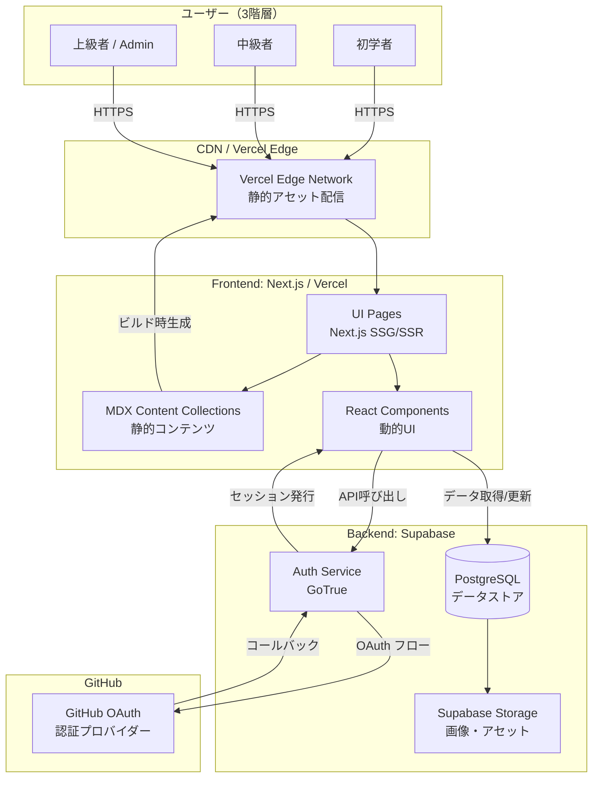
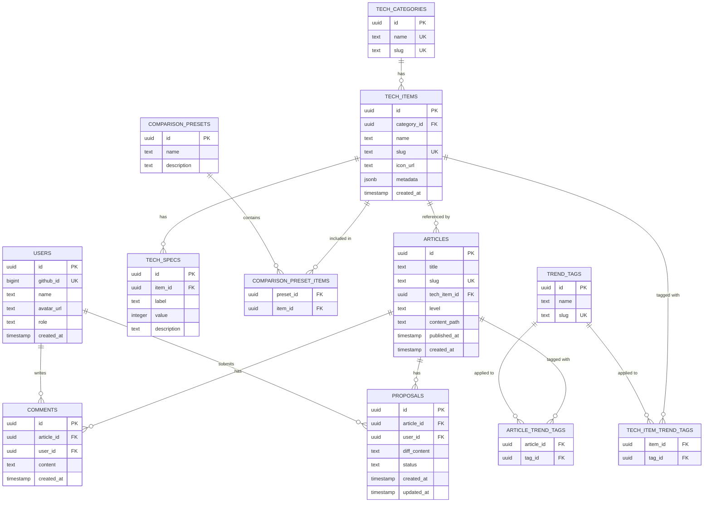
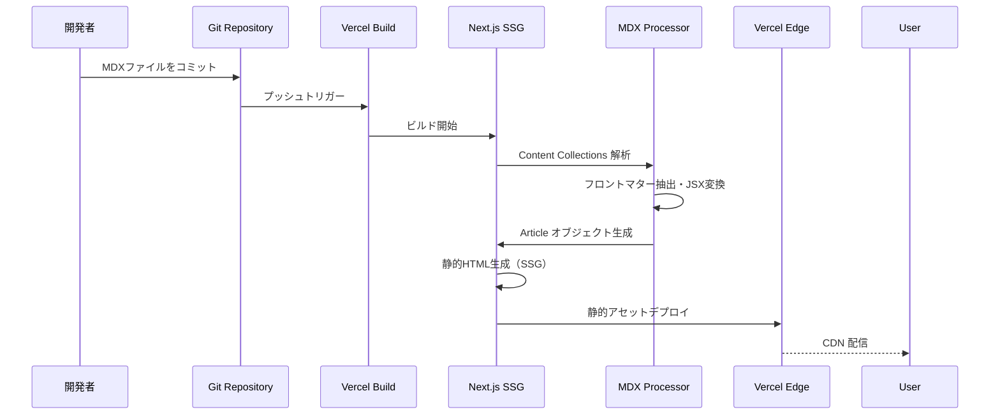
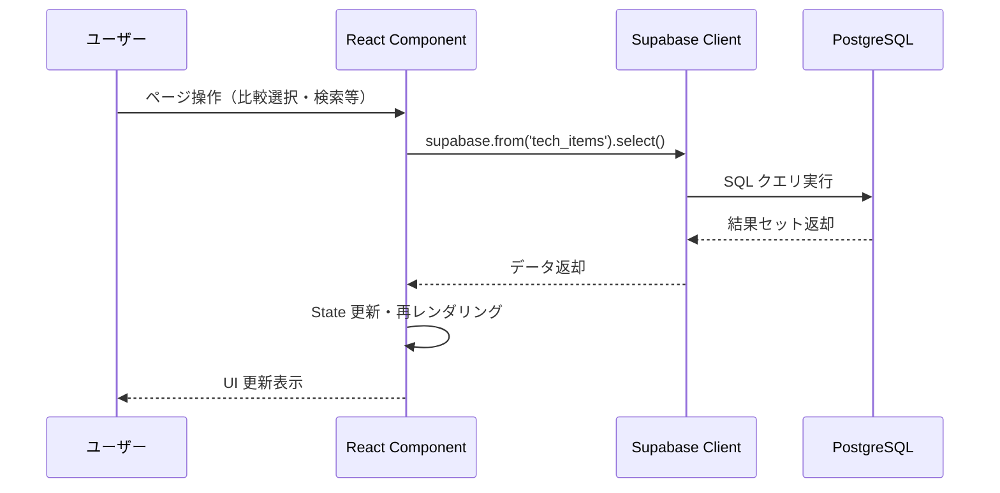
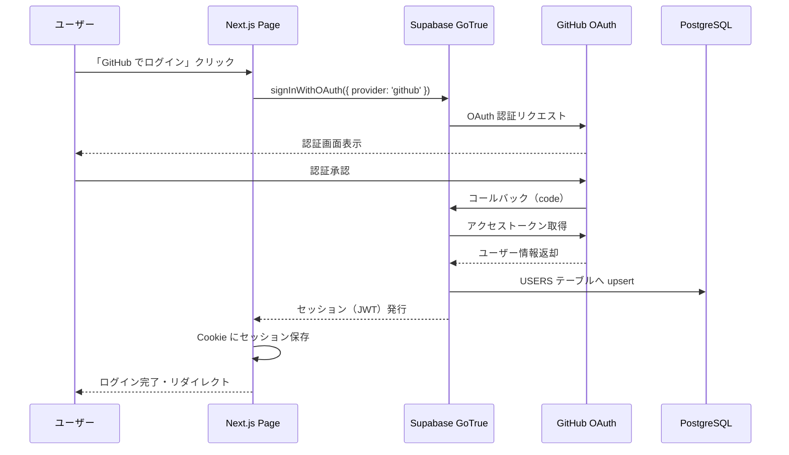

# 設計書: tech-atrium-wiki

## 概要

tech-atrium-wiki（通称: techrium）は、開発者向けの動的な技術 Wiki プラットフォームである。Next.js（SSG/SSR 混合）+ React を Frontend に、Supabase（PostgreSQL / GoTrue）を基盤データストアとして採用し、Vercel 上にデプロイする。

初学者・中級者・上級者の 3 階層ユーザーに対し、MDX ベースの多層的コンテンツ、動的比較エンジン、GitHub OAuth 認証、コメント機能、プルリク型修正提案フローを提供する。Techrium Theme（プリズム・虹色グラデーション）を全体に適用し、視覚的に直感的な UI を実現する。メイン開発者が React フロントと統合方針を主導し、共同開発者は `stack/` 配下で技術スタック別の API 契約と実装雛形を持ち寄る前提とする。

---

## アーキテクチャ

### システム構成図



### 技術スタック

| レイヤー | 技術 | 用途 |
|---|---|---|
| Frontend Framework | Next.js 15.x | SSG/SSR 混合ページ生成 |
| UI Library | React 19 | 動的インタラクティブコンポーネント |
| Styling | Tailwind CSS | Techrium Theme 実装 |
| Content | MDX | 記事コンテンツ管理 |
| Math Rendering | KaTeX / MathJax | LaTeX 数式レンダリング |
| Chart | Chart.js / react-chartjs-2 | レーダーチャート |
| Auth | Supabase GoTrue | GitHub OAuth 認証 |
| Database | Supabase PostgreSQL | データストア |
| Storage | Supabase Storage | 画像・アセット保存 |
| Hosting | Vercel | デプロイ・CDN |

---

## コンポーネントとインターフェース

### 現在のリポジトリ構成

```
/
├── docs/
│   ├── specs/
│   ├── guides/
│   ├── operations/
│   └── reference/
└── stack/
    ├── language/
    ├── framework/
    └── database/
```

### 運用前提

- フロントエンド実装はメイン開発者が `React / Next.js` 前提で統合する
- 共同開発者は `stack/` 配下で担当技術スタックの API 契約、サンプル、実装雛形を管理する
- `stack/framework/react/` はフロント統合観点の共通契約置き場として扱う
- `stack/database/` は DB 単体ではなく、補助 API と組み合わせる前提の資料置き場として扱う

### 主要コンポーネント設計

#### TechPicker

技術選択 UI。Tech_Category でフィルタリングしながら Tech_Item を選択する。

```typescript
interface TechPickerProps {
  /** 選択可能な Tech_Item 一覧 */
  items: TechItem[];
  /** 現在選択中の Tech_Item ID 一覧 */
  selectedIds: string[];
  /** 選択変更時のコールバック */
  onSelectionChange: (ids: string[]) => void;
  /** 最大選択数（デフォルト: 4） */
  maxSelection?: number;
}
```

#### ComparisonMatrix

選択された Tech_Item の Tech_Spec を並列表示する比較テーブル。

```typescript
interface ComparisonMatrixProps {
  /** 比較対象の Tech_Item 一覧 */
  items: TechItemWithSpecs[];
  /** スペックカテゴリ（Performance / DX / Community） */
  specCategories: SpecCategory[];
}

interface TechItemWithSpecs {
  id: string;
  name: string;
  iconUrl: string;
  specs: TechSpec[];
  metadata: {
    sampleCode: string;
    adoptionCases: string[];
  };
}
```

#### TechRadarChart

Tech_Item の比較スコアをレーダーチャートで可視化する。

```typescript
interface TechRadarChartProps {
  /** チャートに表示する Tech_Item 一覧（最大 4 件） */
  items: TechItemWithSpecs[];
  /** チャートの幅（px） */
  width?: number;
  /** チャートの高さ（px） */
  height?: number;
}
```

#### ArticleLevelTabs

Base / Intermediate / Advanced のレベル切り替えタブ。

```typescript
type ArticleLevel = 'base' | 'intermediate' | 'advanced';

interface ArticleLevelTabsProps {
  /** 現在選択中のレベル */
  currentLevel: ArticleLevel;
  /** 利用可能なレベル一覧 */
  availableLevels: ArticleLevel[];
  /** レベル変更時のコールバック */
  onLevelChange: (level: ArticleLevel) => void;
}
```

#### CommentSection

Article に紐づくコメント一覧と投稿フォームを管理する。

```typescript
interface CommentSectionProps {
  /** 対象 Article の ID */
  articleId: string;
  /** ログイン中のユーザー（未ログインの場合は null） */
  currentUser: User | null;
}

interface Comment {
  id: string;
  content: string;
  userId: string;
  user: Pick<User, 'name' | 'avatarUrl'>;
  createdAt: string;
}
```

#### ProposalEditor

記事修正提案の作成・編集フォーム。diff 形式で変更内容を入力する。

```typescript
interface ProposalEditorProps {
  /** 対象 Article の ID */
  articleId: string;
  /** 既存の Proposal（編集時のみ） */
  existingProposal?: Proposal;
  /** 提出完了時のコールバック */
  onSubmit: (proposal: ProposalDraft) => Promise<void>;
}

interface ProposalDraft {
  articleId: string;
  diffContent: string;
}

type ProposalStatus = 'open' | 'merged' | 'closed';

interface Proposal {
  id: string;
  articleId: string;
  userId: string;
  diffContent: string;
  status: ProposalStatus;
  createdAt: string;
}
```

---

## データモデル

### ER 図



### スキーマ設計の補足

- `USERS.role`: `'user'` または `'admin'` の enum 値
- `ARTICLES.level`: `'base'` / `'intermediate'` / `'advanced'` の enum 値
- `PROPOSALS.status`: `'open'` / `'merged'` / `'closed'` の enum 値
- `TECH_ITEMS.metadata`: `{ sampleCode: string, adoptionCases: string[] }` の JSONB
- `TECH_SPECS.value`: 0〜100 の整数スコア
- `COMPARISON_PRESET_ITEMS`: `(preset_id, item_id)` の複合主キー
- `ARTICLE_TREND_TAGS`: `(article_id, tag_id)` の複合主キー
- `TECH_ITEM_TREND_TAGS`: `(item_id, tag_id)` の複合主キー
- Row Level Security (RLS) を全テーブルに適用し、Admin ロールのみ書き込み権限を付与（コメント・提案は認証済みユーザーも可）

---

## データフロー設計

### 静的コンテンツ（MDX）のビルド時生成フロー



### 動的データ（Supabase）のランタイムフェッチフロー



### 認証フロー（GitHub OAuth → Supabase GoTrue → セッション管理）



---

## 正確性プロパティ

*プロパティとは、システムの全ての有効な実行において成立すべき特性や振る舞いのことである。人間が読める仕様と機械が検証可能な正確性保証の橋渡しとなる形式的な記述である。*

### プロパティ 1: MDX ラウンドトリップ特性

*全ての* 有効な Article オブジェクトについて、MDX 形式にシリアライズした後に再度パースしたとき、元の Article オブジェクトと等価なオブジェクトが返されるべきである。

**検証対象: 要件 3.4, 3.5, 3.6**

### プロパティ 2: 比較エンジンの対称性

*任意の* 2 つの Tech_Item A と B について、A と B を比較した結果のスペックデータセットは、B と A を比較した結果のスペックデータセットと等価であるべきである（表示順序を除く）。

**検証対象: 要件 4.1**

### プロパティ 3: コメントバリデーション（空文字列拒否）

*任意の* 空白文字のみで構成される文字列（空文字列・スペース・タブ・改行の組み合わせ）は、コメント投稿時に常に拒否され、コメント一覧の状態が変化しないべきである。

**検証対象: 要件 5.3**

### プロパティ 4: Proposal ステータス遷移の整合性

*任意の* Proposal について、ステータス遷移は `open → merged` または `open → closed` のみ許可され、`merged → open`・`closed → open`・`merged → closed` 等の逆方向・不正な遷移は常に拒否されるべきである。

**検証対象: 要件 6.3, 6.4**

### プロパティ 5: Tech_Item 重複登録拒否

*任意の* Tech_Category と Tech_Item 名の組み合わせについて、同一カテゴリ内に同名の Tech_Item が既に存在する場合、新規登録は常にエラーを返し、データベースの状態が変化しないべきである。

**検証対象: 要件 2.4**

### プロパティ 6: コメント投稿ラウンドトリップ

*任意の* 有効なコメント内容（非空文字列）について、投稿後にそのコメントを取得したとき、元のコメント内容・投稿者 ID が保持されているべきである。

**検証対象: 要件 5.2**

### プロパティ 7: トレンドタグフィルタリングの完全性

*任意の* トレンドタグでフィルタリングしたとき、返却される全ての Article および Tech_Item はそのタグを持ち、かつそのタグを持つ全てのエンティティが結果に含まれるべきである（フィルタリングの完全性と健全性）。

**検証対象: 要件 7.4**

### プロパティ 8: Proposal 重複提出拒否

*任意の* Article と User の組み合わせについて、同一 Article に対して同一 User が既に `open` ステータスの Proposal を持つ場合、新規提案の提出は常に拒否されるべきである。

**検証対象: 要件 6.6**

---

## エラーハンドリング

### エラー分類と対応方針

| エラー種別 | 発生箇所 | 対応方針 |
|---|---|---|
| GitHub OAuth 失敗 | Auth_Service | エラーメッセージ表示 + ログインページへリダイレクト |
| MDX パース失敗 | Content_Service | エラー詳細をログ記録 + エラーページ表示 |
| Supabase 接続失敗 | 全サービス | エラーログ記録 + サービス一時停止メッセージ表示 |
| Tech_Item 重複登録 | Tech_Catalog | 重複エラーレスポンス返却（HTTP 409） |
| 空コメント投稿 | Comment_Service | バリデーションエラーメッセージ表示（投稿拒否） |
| 重複 Proposal 提出 | Proposal_Service | 既存提案の編集を促すメッセージ表示 |
| Tech_Spec データなし | Comparison_Engine | 該当セルに「データなし」表示・他アイテムの比較継続 |
| 検索結果なし | Trend_Service | 「該当する結果が見つかりませんでした」表示 |

### エラーバウンダリ設計

- React コンポーネントは `error.tsx` と機能単位のフェイルセーフ UI を組み合わせ、個別コンポーネントのエラーがページ全体に波及しないようにする
- Supabase クライアントのエラーは `lib/supabase.ts` で一元的にハンドリングし、型安全なエラーオブジェクトを返す
- MDX パースエラーはビルド時に検出し、CI/CD パイプラインで早期に失敗させる

---

## テスト戦略

### テストアプローチ

tech-atrium-wiki は純粋関数（MDX パース・シリアライズ、バリデーションロジック、フィルタリング）を多く含むため、プロパティベーステスト（PBT）と例ベーステストを組み合わせた二層テスト戦略を採用する。

### プロパティベーステスト

**使用ライブラリ**: `fast-check`（TypeScript 向け PBT ライブラリ）

各プロパティテストは最低 100 回のイテレーションを実行する。

```typescript
// タグ形式: Feature: tech-atrium-wiki, Property {番号}: {プロパティ名}
```

| プロパティ | テスト対象関数 | 生成する入力 |
|---|---|---|
| P1: MDX ラウンドトリップ | `parseMdx` / `serializeMdx` | ランダムな有効 Article オブジェクト |
| P2: 比較エンジン対称性 | `compareItems` | ランダムな Tech_Item ペア |
| P3: コメントバリデーション | `validateComment` | 空白文字のみの文字列 |
| P4: Proposal ステータス遷移 | `transitionProposalStatus` | ランダムなステータス遷移ペア |
| P5: Tech_Item 重複拒否 | `createTechItem` | 同一カテゴリ・同名のアイテムペア |
| P6: コメントラウンドトリップ | `createComment` / `getComment` | ランダムな有効コメント内容 |
| P7: タグフィルタリング完全性 | `filterByTag` | ランダムなタグとエンティティセット |
| P8: Proposal 重複拒否 | `createProposal` | 同一 Article/User の重複提案 |

### 例ベーステスト（ユニットテスト）

- 各コンポーネントの正常系レンダリング確認（Vitest + Testing Library）
- 認証フロー（ログイン・ログアウト・セッション管理）
- ダークモード切り替え
- 空検索結果時のメッセージ表示
- Supabase 接続失敗時のエラーメッセージ表示

### インテグレーションテスト

- 検索レスポンスタイム（300ms 以内）の確認
- LCP パフォーマンス計測（Lighthouse CI）
- Supabase マイグレーション実行確認

### スモークテスト

- 主要ページの表示確認（Vercel Preview デプロイ後）
- Techrium Theme の適用確認
- Comparison_Preset の存在確認
- レスポンシブレイアウトの確認（各ブレークポイント）

### フェーズ別テスト計画

| フェーズ | テスト対象 |
|---|---|
| Phase 1 | MDX ラウンドトリップ（P1）、比較エンジン対称性（P2）、コンポーネントレンダリング |
| Phase 2 | コメントバリデーション（P3）、コメントラウンドトリップ（P6）、認証フロー |
| Phase 3 | Proposal ステータス遷移（P4）、重複拒否（P5, P8）、タグフィルタリング（P7）、E2E |
