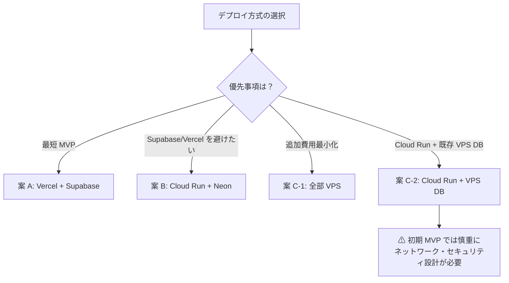

# 要件定義書

## はじめに

tech-atrium-wiki（通称: techrium）は、開発部全員参加型の技術 Wiki / 学習ポータル / 技術共有プラットフォームである。
初学者・中級者・上級者の 3 階層のユーザーに対し、技術の特色・コード例・理論解説・最新トレンドを多層的に提供する。

**育成目的**: 開発部員がフルスタックに近づくことを主目的とし、部員それぞれが自分のレベルに合った技術情報を段階的に習得できる環境を整える。`stack/` 配下の学習・検証コードと、本プロダクト自体の開発体験を通じて、フロントエンド・バックエンド・インフラを横断的に学ぶ場を提供する。

コンテンツ階層は以下の 3 層である。

| 層 | 名称 | 主なコンテンツ |
|---|---|---|
| 1 | Beginner / Overview | 技術スタックの概要、何に使うか、最初に覚えるべき概念、社内・部内での使われ方 |
| 2 | Intermediate / Practice | よく使う実装パターン、Tips・小ネタ、過去に経験した問題・ハマりどころ、ベストプラクティス |
| 3 | Extend / Advanced | 最新技術、直近起きた問題、技術選定・比較、GitHubアカウント認証を通った部外者もコメント可能な議論領域 |

技術カタログ機能と動的比較エンジンにより、複数の言語・フレームワーク・DB を視覚的に比較できる。
GitHub OAuth によるログイン、コメント機能、プルリク型の記事修正提案フローを備え、メイン開発者が React フロントを整備しつつ、共同開発者が `stack/` 配下で技術スタック別の学習・検証コードを持ち寄れる設計とする。

---

## 用語集

- **tech-atrium-wiki**: 本プラットフォームの正式名称
- **techrium**: tech-atrium-wiki の通称
- **開発wiki**: 本プラットフォームの日本語名称
- **System**: tech-atrium-wiki 全体を指す総称
- **Content_Service**: MDX コンテンツの管理・配信を担うサブシステム
- **Auth_Service**: GitHub OAuth を用いた認証・認可を担うサブシステム（Supabase Auth または Auth.js のいずれかを選択）
- **Comparison_Engine**: 複数の Tech_Item を選択し、スペック情報を並列表示するサブシステム
- **Proposal_Service**: 記事修正提案の投稿・レビュー・マージを管理するサブシステム
- **Comment_Service**: 記事へのコメント投稿・表示を管理するサブシステム
- **Trend_Service**: 言語・インフラ別の最新トレンド情報を管理・配信するサブシステム
- **User**: GitHub OAuth でログインした登録ユーザー
- **Admin**: 記事・修正提案の承認権限を持つ管理者ユーザー
- **Article**: レベル（Base / Intermediate / Advanced）を持つ技術解説コンテンツ
- **Tech_Category**: 技術の分類（例: Language, Database, Framework）
- **Tech_Item**: Tech_Category に属する個別の技術エンティティ（例: PostgreSQL, TypeScript）
- **Tech_Spec**: Tech_Item に紐づくスペック指標（例: 書きやすさ 80/100）
- **Proposal**: ユーザーが提出する記事の修正提案
- **Comparison_Preset**: 推奨比較セット（例: モダンな Web 開発セット）
- **Techrium_Theme**: プリズム・虹色グラデーションを基調としたデザインテーマ
- **Stack Workspace**: 共同開発者が技術スタック別の学習サンプル・PoC・検証コードを配置する `stack/` 配下の作業領域（本番 API 群ではない）
- **MDX**: Markdown + JSX を組み合わせたコンテンツ形式
- **LaTeX**: 数式・理論解説に用いる組版記法
- **ADR**: Architecture Decision Record（アーキテクチャ決定記録）

---

## 要件

### 要件 1: ユーザー認証

**ユーザーストーリー:** 開発者として、GitHub アカウントでログインしたい。そうすることで、アカウント作成の手間なくプラットフォームの機能を利用できる。

**実装方式の選択:** Auth_Service の実装は、採用するデプロイ方式に応じて以下のいずれかを選択する。

- **Supabase Auth + GitHub OAuth**: 案 A（Vercel + Supabase）を採用する場合
- **Auth.js（NextAuth.js）+ GitHub OAuth**: 案 B（Cloud Run + Neon）または案 C（VPS）を採用する場合

#### 受け入れ基準

1. WHEN ユーザーが「GitHub でログイン」を選択したとき、THE Auth_Service SHALL GitHub OAuth 認証フローを開始する
2. WHEN GitHub OAuth 認証が成功したとき、THE Auth_Service SHALL github_id・name・avatar_url を Users テーブルに保存またはアップサートする
3. WHEN GitHub OAuth 認証が失敗したとき、THE Auth_Service SHALL エラーメッセージをユーザーに表示し、ログインページへリダイレクトする
4. WHILE ユーザーがログイン済みのとき、THE System SHALL ヘッダーにアバター画像とユーザー名を表示する
5. WHEN ユーザーがログアウトを選択したとき、THE Auth_Service SHALL セッションを破棄しトップページへリダイレクトする

---

### 要件 2: 技術カタログ管理

**ユーザーストーリー:** 管理者として、言語・フレームワーク・DB などの技術を独立したエンティティとして登録・管理したい。そうすることで、比較エンジンやコンテンツと一貫したデータを紐づけられる。

#### 受け入れ基準

1. THE System SHALL Tech_Category（Language, Database, Framework 等）を管理する機能を提供する
2. WHEN Admin が Tech_Item を登録するとき、THE System SHALL name・icon_url・metadata（基本コード・採用事例）を保存する
3. WHEN Admin が Tech_Spec を登録するとき、THE System SHALL label・value（数値スコア）・description を Tech_Item に紐づけて保存する
4. IF 同一 Tech_Category 内に同名の Tech_Item が既に存在するとき、THEN THE System SHALL 重複エラーを返し登録を中止する
5. THE System SHALL Tech_Item の一覧を Tech_Category 別にフィルタリングして表示する機能を提供する

---

### 要件 3: 多層的コンテンツ（Article）管理

**ユーザーストーリー:** 開発者として、同一テーマに対して自分のレベルに合った解説を読みたい。そうすることで、基礎から応用まで段階的に学習できる。

**コンテンツ管理方針:**
- **記事本文**: MDX ファイルとして Git 管理する（リポジトリ内 `content/` ディレクトリ）
- **コメント・ユーザー・メタデータ**: データベース（PostgreSQL）に保存する
- この分離により、インフラ方式（案 A / B / C）が変わっても記事コンテンツは Git 上で保全される

#### 受け入れ基準

1. THE Content_Service SHALL Article に Base・Intermediate・Advanced の 3 段階のレベルフラグを付与する
2. WHEN ユーザーが Article ページを開いたとき、THE Content_Service SHALL 選択されたレベルに対応する MDX コンテンツを表示する
3. WHERE Intermediate または Advanced レベルの Article において、THE Content_Service SHALL LaTeX 記法で記述された数式を正しくレンダリングする
4. THE Content_Service SHALL MDX ファイルを解析し、Article オブジェクトとして表示する
5. THE Content_Service SHALL Article オブジェクトを MDX 形式に整形して出力する
6. FOR ALL 有効な Article オブジェクトについて、MDX 解析 → 整形 → 再解析を行ったとき、THE Content_Service SHALL 元の Article オブジェクトと等価なオブジェクトを返す（ラウンドトリップ特性）
7. IF MDX ファイルの解析に失敗したとき、THEN THE Content_Service SHALL 解析エラーの詳細をログに記録し、エラーページを表示する

---

### 要件 4: 動的比較エンジン

**ユーザーストーリー:** 開発者として、複数の技術をスマホ機種比較のような UI で並列比較したい。そうすることで、技術選定の意思決定を効率化できる。

#### 受け入れ基準

1. WHEN ユーザーが 2 つ以上の Tech_Item を選択したとき、THE Comparison_Engine SHALL 選択された Tech_Item の Tech_Spec・基本コード・採用事例をテーブル形式で並列表示する
2. THE Comparison_Engine SHALL 各 Tech_Spec の指標（Performance・Developer Experience・Community/Ecosystem）をテーマカラー（赤・青・緑系）で色分けして表示する
3. THE Comparison_Engine SHALL レーダーチャートを用いて Tech_Item の比較スコアを視覚的に表示する
4. WHEN ユーザーが Comparison_Preset を選択したとき、THE Comparison_Engine SHALL プリセットに定義された Tech_Item を自動的に選択し比較表示する
5. THE System SHALL 「モダンな Web 開発セット」「高負荷耐性セット」を含む Comparison_Preset を提供する
6. IF 選択された Tech_Item に Tech_Spec データが存在しないとき、THEN THE Comparison_Engine SHALL 該当セルに「データなし」と表示し、他の Tech_Item の比較表示を継続する

---

### 要件 5: GitHub 連携コメント機能

**ユーザーストーリー:** ログイン済みの開発者として、Article にコメントを投稿したい。そうすることで、技術的な議論や補足情報を共有できる。

**コメント機能と認証方式:** GitHub OAuth でログインしたユーザーのみコメントを投稿できる。認証実装は要件 1 の Auth_Service 方式（Supabase Auth または Auth.js）に依存する。コメントデータはデータベースに保存する。

#### 受け入れ基準

1. WHILE ユーザーがログイン済みのとき、THE Comment_Service SHALL Article ページにコメント投稿フォームを表示する
2. WHEN ユーザーがコメントを投稿したとき、THE Comment_Service SHALL コメント内容・投稿者 ID・投稿日時を保存し、Article ページに表示する
3. IF コメント内容が空文字列のとき、THEN THE Comment_Service SHALL 投稿を拒否しバリデーションエラーメッセージを表示する
4. WHILE ユーザーが未ログインのとき、THE Comment_Service SHALL コメント投稿フォームの代わりにログインを促すメッセージを表示する
5. THE Comment_Service SHALL Article に紐づくコメントを投稿日時の昇順で表示する

---

### 要件 6: プルリク型記事修正提案

**ユーザーストーリー:** ログイン済みの開発者として、Article の誤りや改善点を修正提案として提出したい。そうすることで、コミュニティ主導でコンテンツの品質を向上できる。

#### 受け入れ基準

1. WHILE ユーザーがログイン済みのとき、THE Proposal_Service SHALL Article ページに「修正を提案する」ボタンを表示する
2. WHEN ユーザーが修正提案を提出したとき、THE Proposal_Service SHALL diff_content・article_id・user_id を保存し、ステータスを open に設定する
3. WHEN Admin が Proposal を承認したとき、THE Proposal_Service SHALL diff_content を Article に適用し、ステータスを merged に更新する
4. WHEN Admin が Proposal を却下したとき、THE Proposal_Service SHALL ステータスを closed に更新し、提案者に通知する
5. THE Proposal_Service SHALL open ステータスの Proposal 一覧を Admin 向けに表示する
6. IF 同一 Article に対して同一 User が既に open ステータスの Proposal を持つとき、THEN THE Proposal_Service SHALL 新規提案の提出を拒否し、既存提案の編集を促すメッセージを表示する

---

### 要件 7: トレンドフィルタリング・検索

**ユーザーストーリー:** 上級者として、言語・インフラ別の最新トレンドをフィルタリング・検索して把握したい。そうすることで、技術動向を効率的にキャッチアップできる。

#### 受け入れ基準

1. THE Trend_Service SHALL Article および Tech_Item をキーワード・Tech_Category・レベルで絞り込む検索機能を提供する
2. WHEN ユーザーが検索クエリを入力したとき、THE Trend_Service SHALL 入力から 300ms 以内に候補一覧を表示する
3. THE Trend_Service SHALL トレンドタグ（例: 「2025 注目」「高負荷対応」）を Tech_Item および Article に付与する機能を提供する
4. WHEN ユーザーがトレンドタグを選択したとき、THE Trend_Service SHALL 該当タグを持つ Article および Tech_Item の一覧を表示する
5. IF 検索クエリに一致する Article および Tech_Item が存在しないとき、THEN THE Trend_Service SHALL 「該当する結果が見つかりませんでした」と表示する

---

### 要件 8: UI・デザインシステム（Techrium Theme）

**ユーザーストーリー:** 開発者として、視覚的に直感的なインターフェースで技術情報を閲覧したい。そうすることで、情報の理解と比較が容易になる。

#### 受け入れ基準

1. THE System SHALL Techrium Theme（プリズム・虹色グラデーション）を全ページに適用する
2. THE System SHALL Performance 指標を赤色系、Developer Experience 指標を青色系、Community/Ecosystem 指標を緑色系で表示する
3. THE System SHALL モバイル・タブレット・デスクトップの各ブレークポイントでレイアウトが崩れないレスポンシブデザインを提供する
4. WHEN ページが初回ロードされるとき、THE System SHALL Largest Contentful Paint を 2.5 秒以内に完了する
5. WHERE ユーザーがダークモードを OS 設定で有効にしているとき、THE System SHALL Techrium Theme のダークモードバリアントを適用する

---

### 要件 9: デプロイ・インフラ方式

**ユーザーストーリー:** 開発チームとして、コスト・学習効果・運用負荷を考慮したうえでインフラ構成を選択し、段階的にフィーチャーをリリースしたい。そうすることで、リスクを抑えながら継続的に機能を拡張できる。

#### 9-1: デプロイ候補案の比較

本システムのデプロイ・インフラ方式は以下の 3 案を正式な候補とし、チームの状況に応じて選択する。Supabase / Vercel は最速の候補であるが、唯一の前提ではない。

| 項目 | 案 A: Vercel + Supabase | 案 B: Cloud Run + Neon | 案 C-1: 全部 VPS | 案 C-2: Cloud Run + VPS DB |
|---|---|---|---|---|
| フロント / ホスティング | Vercel | Cloud Run (Next.js standalone) | VPS + Docker Compose | Cloud Run |
| 認証 | Supabase Auth + GitHub OAuth | Auth.js + GitHub OAuth | Auth.js + GitHub OAuth | Auth.js + GitHub OAuth |
| データベース | Supabase PostgreSQL | Neon PostgreSQL | VPS PostgreSQL | VPS PostgreSQL |
| ストレージ | Supabase Storage | GCS または Git 管理 | VPS ローカルまたは GCS | GCS または VPS |
| MVP 開発速度 | ◎ 最速 | ○ 速い | △ 初期設定が多い | △ ネットワーク設計が必要 |
| 月額費用目安 | 〜5,000 円（無料枠活用） | 〜5,000 円以内を狙いやすい | VPS 費用のみ（追加費用少） | Cloud Run + VPS の両方 |
| BaaS 依存 | 強い | 低い | なし | なし |
| 運用負荷 | 低い | 低〜中 | 高い | 高い |
| 学習価値 | BaaS 活用 | コンテナ + マネージド DB | フルスタック運用 | 中間構成 |
| 初期 MVP 推奨度 | ◎ | ○ | △ | × 注意が必要 |

**案 C-2 の注意事項**: Cloud Run から VPS 上の PostgreSQL への接続は、ネットワーク・セキュリティ設計（VPC、ファイアウォール、TLS 等）が必要であり、MVP 初期の第一候補としては推奨しない。

#### 9-2: 望ましい方式の選択指針

- **最短 MVP を優先する場合**: 案 A（Vercel + Supabase）
- **Supabase / Vercel を避けたい場合の本命**: 案 B（Cloud Run + Neon PostgreSQL）
- **追加費用を最小化したい場合**: 案 C-1（VPS + Docker Compose）
- **Cloud Run + VPS DB を使う場合**: 可能だが、初期はネットワーク・セキュリティ面で慎重に扱うこと
- **いずれの場合も**: MVP ではバックエンドを複数に分けず、単一アプリ構成を基本とする

#### 9-3: MVP バックエンド構成方針

**MVP では単一の Web アプリ / 単一の主要バックエンドを原則とする。**

本番バックエンドを分割する場合は、以下の条件をすべて満たす必要がある。

1. 単一 Web アプリ構成では解決しづらい明確な理由がある
2. 認証・認可・データ整合性の責務が明確である
3. 運用担当者が決まっている
4. ADR に採用理由を記録する
5. API 契約、障害時の挙動、監視方法が定義されている

#### 9-4: フェーズ別リリース計画

| フェーズ | 内容 |
|---|---|
| Phase 1 | Next.js + Tailwind 環境構築、MDX スキーマ設計、比較コンポーネント実装 |
| Phase 2 | DB 統合（選択した方式に応じて Supabase / Neon / VPS PostgreSQL）、GitHub OAuth 認証、コメント機能 |
| Phase 3 | 修正提案フロー、トレンドフィルタリング、本番デプロイ |

#### 受け入れ基準

1. THE System SHALL 選択されたデプロイ方式（案 A・B・C のいずれか）に従い、Next.js アプリを単一サービスとしてデプロイする
2. THE System SHALL PostgreSQL をデータストアとして使用し、マイグレーションファイルでスキーマを管理する
3. THE System SHALL 記事本文を MDX ファイルとして Git 管理し、コメント・ユーザー・メタデータはデータベースに保存する
4. IF データベースへの接続が失敗したとき、THEN THE System SHALL エラーをログに記録し、ユーザーにサービス一時停止メッセージを表示する
5. THE System SHALL 画像（アバター・Tech_Item アイコン）を適切なストレージ（Supabase Storage / GCS / VPS ローカル）に保存する（採用方式に依存）
6. THE System SHALL 言語・フレームワークごとの担当者が並行して記事・比較データ・UI コンポーネントを更新できるよう、コンテンツ・表示ロジック・データモデルを疎結合に保つ

---

### 要件 10: Stack Workspace（学習・検証領域）

**ユーザーストーリー:** 共同開発者として、`stack/` 配下で技術スタック別のサンプルコードや検証実装を管理したい。そうすることで、フルスタック開発の学習を深め、将来の本番切り出し候補を検討できる。

**位置づけ:** `stack/` 配下の実装は以下の目的のみを持ち、MVP 段階でただちに本番マイクロサービスとして統合するものではない。

- 学習用サンプル（各言語・フレームワーク・DBの実装例）
- 技術記事の材料（実装パターンの解説素材）
- API 契約や実装比較の検証（Spike / PoC）
- 将来の本番切り出し候補の蓄積

#### 受け入れ基準

1. THE System SHALL `stack/` 配下で共同開発者が言語・フレームワーク・データベースごとの学習サンプルと検証コードを管理できるようにする
2. THE System SHALL 共同開発者が提出する API 実装について、React フロントが扱いやすい HTTP/JSON インターフェースを基本契約とする（検証目的の場合）
3. THE System SHALL `stack/` 配下の実装が本番バックエンドとして統合される場合は、要件 9-3 のバックエンド分割条件をすべて満たすことを必須とする

---

## 非機能要件

### NFR-1: パフォーマンス

- THE System SHALL 検索クエリへの応答を入力から 300ms 以内に返す
- THE System SHALL Largest Contentful Paint を 2.5 秒以内に完了する

### NFR-2: 予算制約

- THE System SHALL 月額運用費用を 5,000 円程度以内に収めることを目標とする
- 各デプロイ案は無料枠・低コストプランを最大限活用する設計を前提とする

### NFR-3: 可用性・運用

- THE System SHALL データベーススキーマをマイグレーションファイルで管理し、変更履歴を Git に記録する
- THE System SHALL 記事コンテンツを Git 管理することで、インフラ移行時もコンテンツを保全する

### NFR-4: セキュリティ

- THE System SHALL GitHub OAuth のシークレット・DB 接続文字列等の機密情報を環境変数として管理し、リポジトリにコミットしない
- THE System SHALL 認証済みユーザーのみがコメント投稿・修正提案の提出を行えるよう、API レベルで認可チェックを実施する

### NFR-5: 学習・育成

- THE System の開発プロセス自体が、開発部員のフルスタック技術習得の場となるよう設計する
- インフラ方式の選択・移行を通じて、コンテナ・クラウド・DB 運用を実践的に学べる機会を提供する
